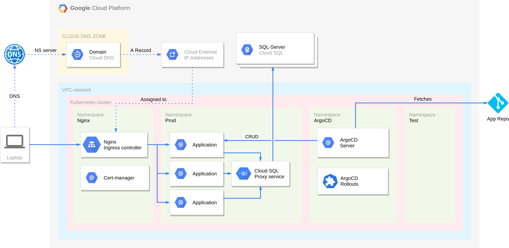

# Terraform confiuration for automatic deployment of applications to Google Cloud Platforms' Kubernetes engine

This repository is part of a bachelor thesis done by four students at NTNU. 

The repo aims to automate deployment of complex applications to GCPs' Kubernetes Engine.

## Contents
  - [Prerequisites](#prerequisites)
  - [Quick start](#quick-start)
  - [What it deploys](#what-it-deploys)
  - [Configuration](#configuration)
  - [TODOs](#todos)
  - [Authors](#authors)

## Prerequisites

- A Google Cloud Platform project with a suitable funding solution.

- A GCS bucket to remotely store the Terraform state. Change the name of the bucket in **terraform/dev/backend.tf** to the name of your bucket.

- Service account with the following roles:
    - Kubernetes Engine Admin
    - Editor
    - Project IAM Admin

  Download the credentials for the service account in json format, rename the file "**credentials.json**" and place it in under *terraform/dev*. This service account is used to authenticate the remote backend in GCS and as credentials for the various Google providers in the repository.

- If using Cloud SQL, a service account with the role **Cloud SQL Client** is required. Download the credentials for the service account in json format, rename the file "**proxyCreds.json**" and place it under *terraform/dev*. This service account is used to authenticate the Cloud SQL Proxy. 

## Quick start
1. Clone this repository.
1. Ensure prerequisites are fulfilled.
1. Set the variables in **terraform/dev/terraform.tfvars** to the desired values.
1. Run the **terraform/scripts/tf-init.sh** script to initialize the Terraform configuration.
1. Run the **terraform/scripts/tf-apply.sh** script to apply the Terraform configuration.
1. Run the **terraform/scripts/tf-destroy.sh** script to destroy the Terraform configuration.

## What it deploys

The Terraform configuration can be configured to deploy the following:

- An autoscaling GKE cluster
- A managed SQL database with connection from GKE cluster via cloudsql proxy deployed as a service.
- Cloud DNS zone with domain
- A NGINX ingress controller with domain pointing to the controller via A record
- Cert-Manager with Let's Encrypt issuer
- ArgoCD along with Argo Rollouts for CD of applications
- Google Hipster Shop as a demo application

## Configuration

## TODOs
- ArgoCD TLS ingress currently has the domain hardcoded in the K8s ingress manifest (*terraform/modules/argo/k8s/argocd-ingress.yaml*).
- Uptime check uses hardcoded domain (*terraform/modules/argo/main.tf*).
- Change from default admin password(argocd-server podname) and store somewhere secure (*terraform/modules/argo/main.tf*).

## Authors
Erlend Fonnes, Johan Selnes, Aksel Baardsen, Knut Jørgen Totland

*During the project, we used [Vscode liveshare](https://marketplace.visualstudio.com/items?itemName=MS-vsliveshare.vsliveshare). The commits are therefore not directly attributable to the author.*